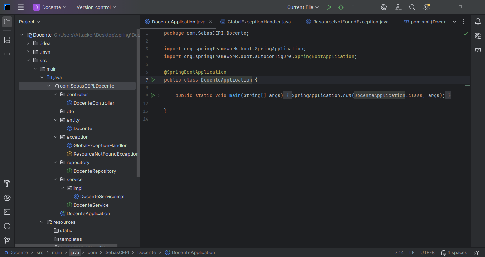
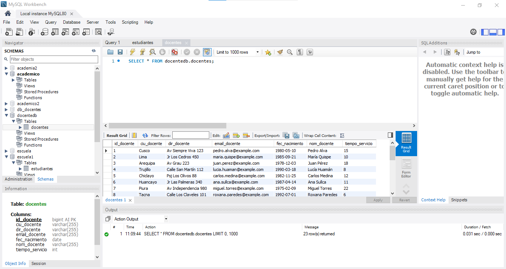
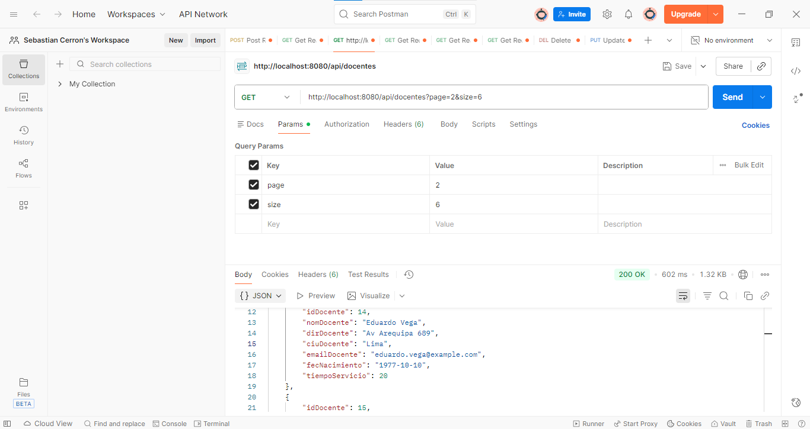

Muestra de trabajos.

Para el trabajo se hizo un Grud de Docentes utilizando Spring y JSP, la cual los resultados fueron los siguientes:

### Codigo Fuentes

### Base de datos MySQL

### Funcionamiento en postman

