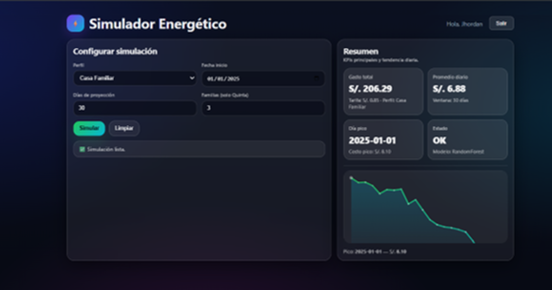

En esta semana se realizó el trabajo de la EVALUACIÓN FINAL. Este consiste en  una aplicación web inteligente orientada al análisis y generación de datos predictivos de consumo energético, basada en el uso de modelos de inteligencia artificial y series temporales. Su finalidad es estimar y proyectar el consumo eléctrico en distintos horizontes de tiempo a partir de datos históricos obtenidos de medidores inteligentes.

## Resultados

Luego de utilizar el modelado, configurar sus funciones y diseñar la interfaz se obtuvo la aplicación, la cual se mostrará a continuación. Primero se tiene el inicio, donde se ingresará al usuario para utilizar el dashboard de la aplicación, la cual se confirmará con POST /login para su ingreso a la aplicación.

 
Caso que el usuario no tenga una cuenta para ingresar a la aplicación, se tendrá la opción de crearse una, ingresando sus datos, usando POST para almacenar la cuenta nueva en la base de datos en MySQL.

 
Al iniciar la sesión, se generará un token, permitiendo que mantenga la sesión y que esté protegida usando GET /profile.

 
Al final se tendrá el Dashboard del Simulador energético, donde se configura las características para la simulación, obteniendo como resultado Gasto total, Promedio diario, Día pico y Estado, junto con un gráfico de líneas.

 
