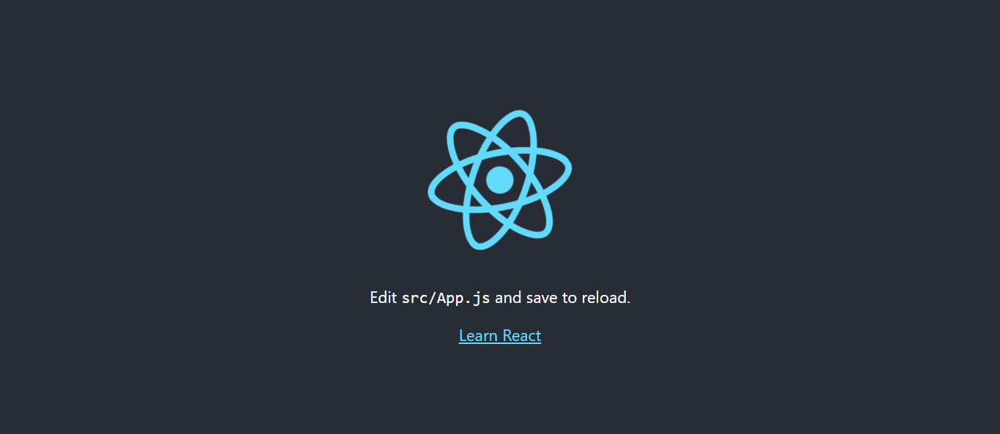
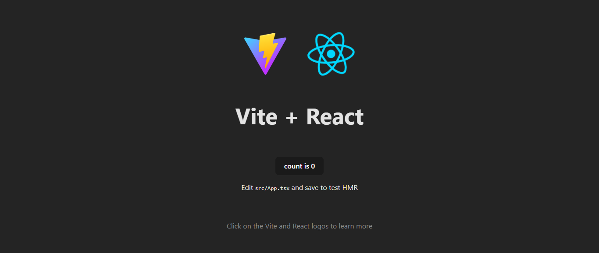
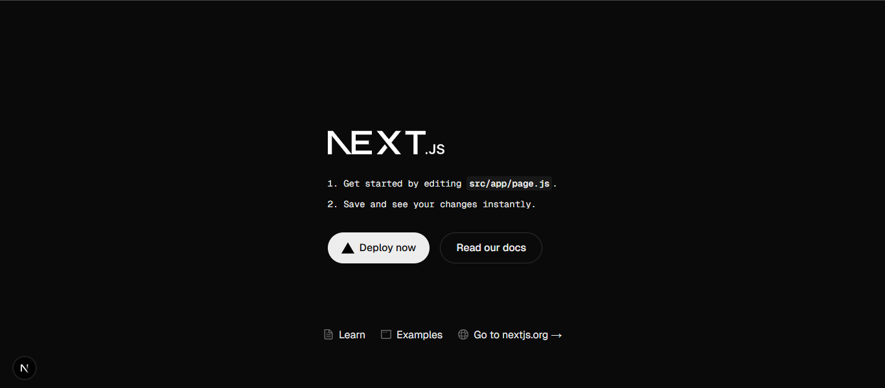

Poniendo a pruebo los conocimientos

Durante esta semana se desarrollo una práctica y luego se explicaron nuevos temas

# Practica 03

[Link de la práctica realizada](https://github.com/PUM748/PracticaCalificada3) 

En esta práctica se desarrollo 2 páginas, utilizando html, CSS y Javascript, ya que contará con funciones en esta página:

1. La primera consistio en crear una ruleta para sorteos, la cual permite utilizar algunas teclas para realizar una funcion


2. La segunda consistía en introducir nombres en un cuadro para luego realizar un sorteo de equipo, la página daba la opcion de sortear el equipo eligiendo la cantidad de integrantes o la cantidad de grupo.


# Introducciòn al Desarrollo con React

Se adentro al tema de React, la cual es una libreria de código de JavaScript para crear interfaces de usuario, permite crear SPA y componenetes de interfaz de usuario que se puede reutilizar.

Para su uso, se tuvo que instalar Node JS para la creacion de proyectos React, luego de conocer las ventajas de utilizar React, y sus propiedades se procedio a crear los proyectos con las siguientes herramientas:

1. Create React App: Configura tu ambiente de desarrollo de forma que puedas usar las últimas
características de Javascript, para una buena experiencia de desarrollo, y optimizando tu aplicación para
producción. Requiere Node >= 14.0.0 y npm >= 5.6.

Primero, se escoge el lugar donde se creará el proyecto, luego se abre el simbolo de sistema ya teniendo la direccion de la ubicacion donde se realizará la acción.

```cmd
npx create-react-app "nombre del proyecto"

cd "nombre del proyecto"
npm start
```


2. Vite: Vite se define como una herramienta de frontend que te ayudará a crear tus proyectos de forma agnóstica (sin atarte a ningún framework concreto) y que su desarrollo y construcción final sea lo más sencilla y cómoda posible. Está desarrollada por Evan You, el creador de Vue.

```cmd
npx create Vite "Nombre del proyecto"

cd "Nombre del proyecto"
npm install
npm run dev
```


3. Next.js: Next.js es un pequeño framework construido sobre React.js que viene a ayudar a reducir esta fatiga. ¿Cómo? Next nos permite, instalando una sola dependencia, tener configurado todo lo que necesitamos para crear una aplicación de React usando Babel, Webpack, server render y muchas otras técnicas como HMR o separación de código y… ¡hasta hace más fácil hacer deploy de nuestras aplicaciones! 

```cmd
npx create-next-app
Yes
"Nombre del proyecto"
```

