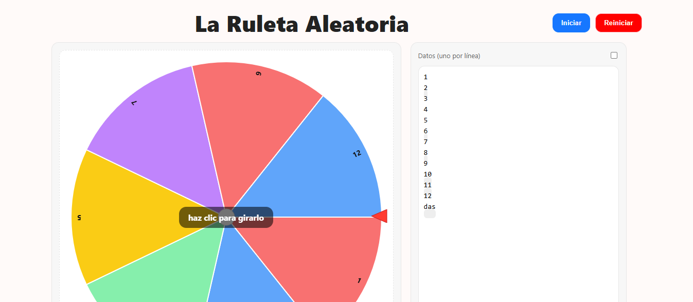
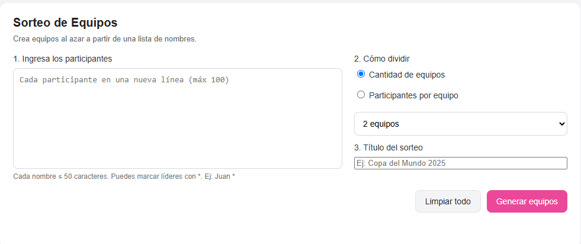

Durante esta semana se desarrollo una práctica y luego se explicaron nuevos temas

# Practica 03

[Link de la práctica realizada](https://github.com/PUM748/PracticaCalificada3) 

En esta práctica se desarrollo 2 páginas, utilizando html, CSS y Javascript, ya que contará con funciones en esta página:

1. La primera consistio en crear una ruleta para sorteos, la cual permite utilizar algunas teclas para realizar una funcion

2. La segunda consistía en introducir nombres en un cuadro para luego realizar un sorteo de equipo, la página daba la opcion de sortear el equipo eligiendo la cantidad de integrantes o la cantidad de grupo.

# Introducciòn al Desarrollo con React
