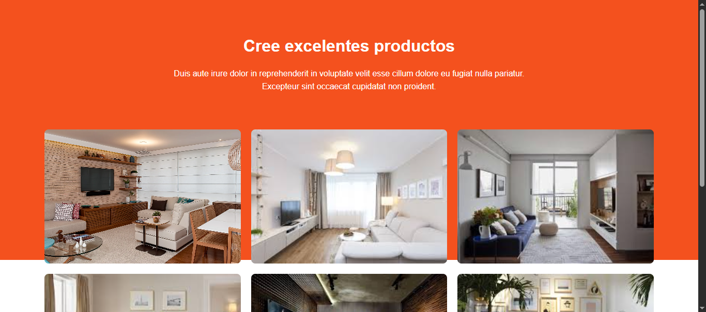

Hora de poner en practica lo aprendido.

## Practica de la semana 03

En esta semana se realizaron prácticas relacionados a los temas aprendidos (HTML y CSS)
 
[Contenido de la práctica en Github](https://github.com/Jhordan21-H/SEMANA3_DESARROLLOWEB)

En la practica consistia lo siguiente:

1. Diseñar la pagina principal donde tienen animaciones, la cual permitira ir a las tres páginas diseñadas

2. En la primera página se tiene un formulario la cual se va a rellenar con el nombre, el E-mail, el Item y una imagen que va a ingresar el usuario, en esta página tambien cuenta con animación y efectos.

3. En la segunda página se diseñó una interfaz donde se puede modificar el volumen y alarma del dispositivo, tambien tiene con un cambiador de color, contando con tres deslizadores la cual permitira cambiar el color mostrado en el cuadro.

4. Por ultimo se tiene el diseño de una página de venta la cual permitira al usuario ver las imagenes, tambien cuenta con animación y efectos.

