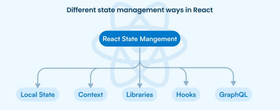
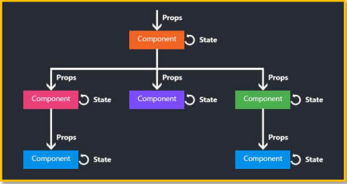
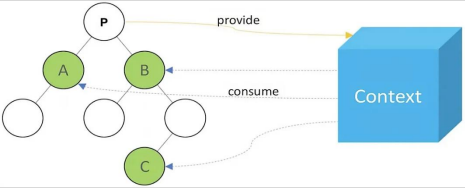
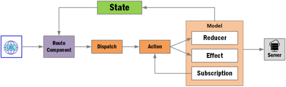
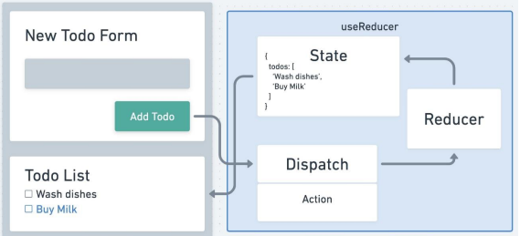

Aprende un nuevo tema.

# Hooks en React

###  1. Introducción a los Hooks

* Los **Hooks** fueron incorporados en **React 16.8**.
* Permiten usar **estado y otras características de React** en componentes funcionales, eliminando la necesidad de los componentes de clase.
* Un **Hook** es una **función especial de JavaScript** que gestiona el estado y el ciclo de vida del componente.

**Tipos principales:**
`useState`, `useEffect`, `useContext`, `useReducer`, `useRef`, además de conceptos como **Lazy Loading** y **Suspense**.

---

###  2. Gestión de Estado (*State Management*)

* Es el proceso de **seguir y actualizar el estado** de una aplicación (por ejemplo: posición del usuario, artículos del carrito, etc.).
* Puede manejarse localmente o globalmente, según el tamaño del proyecto.
* El **estado** es un **objeto** que almacena datos que afectan la representación visual de la interfaz.



**Diferencia entre State y Props:**

* `props`: datos inmutables que vienen del componente padre.
* `state`: datos internos del componente que pueden cambiar con el tiempo.



---

###  3. Hook **useState**

Permite agregar y actualizar el **estado local** en un componente funcional.

**Sintaxis:**

```js
const [propiedad, setPropiedad] = useState(valorInicial)
```

**Uso:**

1. Importar `useState`
2. Inicializarlo con un valor
3. Leer el estado
4. Actualizarlo con su setter

Puede manejar **múltiples estados** o **objetos** como estado.
Cuando el valor cambia, el componente se **re-renderiza automáticamente**.

---

###  4. Hook **useEffect**

Permite ejecutar **efectos secundarios** (como llamadas a APIs o manipulación del DOM) después del render.

**Sintaxis:**

```js
useEffect(función, dependencias)
```

**Tipos de ejecución:**

* 🔹 *Mount* → `[]` (solo una vez al cargar)
* 🔹 *Render/Post-render* → sin dependencias
* 🔹 *Update* → cuando cambian valores específicos

**Usos comunes:**

* Llamadas `fetch`
* Temporizadores
* Actualización del DOM

---

###  5. Hook **useContext**

Facilita **compartir información global** sin necesidad de pasar props manualmente por cada componente.



**Sintaxis básica:**

```js
const MiContexto = React.createContext('valor por defecto');

<MyContext.Provider value={datoCompartido}>
  <ComponenteHijo />
</MyContext.Provider>

const dato = useContext(MiContexto);
```

Permite que varios componentes accedan a un **estado global** (ej. datos del usuario, tema visual, etc.).

---

###  6. **Custom Hooks**

Son **hooks personalizados** creados por el desarrollador para **reutilizar lógica y estado**.

**Buenas prácticas:**

* El nombre debe comenzar con `use...`
* Encapsular solo una lógica por hook
* Mantener el estado al mínimo
* Cuidar el arreglo de dependencias en `useEffect`
* Documentar y probar cada hook

📘 *Ejemplo:* `useFetch`, `useEventListener`, `useForm`.

---

###  7. Hook **useReducer**

Alternativa avanzada a `useState` para manejar **estados complejos** o múltiples variables.



**Sintaxis:**

```js
const [state, dispatch] = useReducer(reducer, estadoInicial);
```

**Reducer:**

```js
function reducer(state, action) {
  switch(action.type) {
    case 'incrementar': return {count: state.count + 1};
    default: return state;
  }
}
```

Usa `dispatch` para ejecutar acciones.
Ideal cuando hay estructuras anidadas u operaciones dependientes.

**Diferencia principal con useState:**

* `useState`: para estados simples.
* `useReducer`: para estados más estructurados o lógicos.



---

###  8. Hook **useNavigate**

Parte de **React Router DOM v6**.
Reemplaza a `useHistory` y `useLocation`.

**Permite navegar entre rutas** de forma programática:

```js
const navigate = useNavigate();
navigate('/home');
navigate(-1); // volver atrás
```

---

###  9. Hook **useParams**

Obtiene los **parámetros dinámicos** de una URL que coinciden con la ruta actual.

**Ejemplo:**

```js
<Route path="/user/:id" element={<User />} />

const { id } = useParams(); // obtiene el id de la URL
```

---


