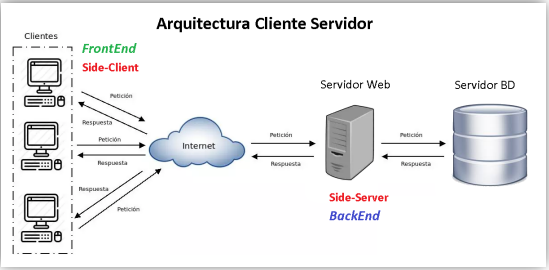
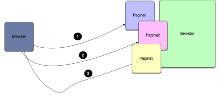
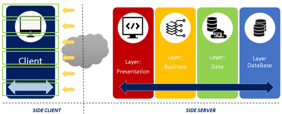
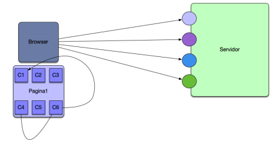
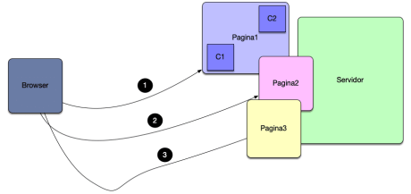
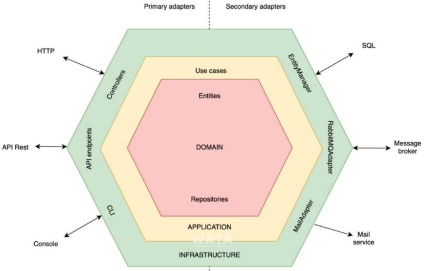
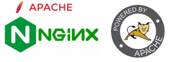
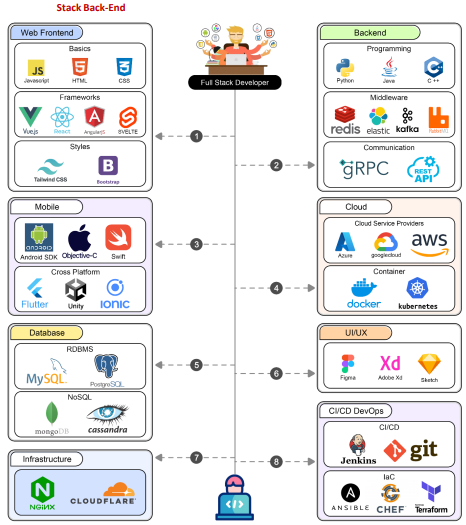
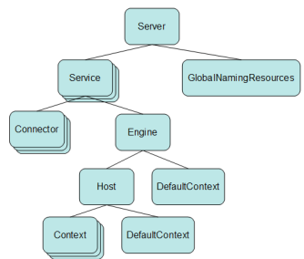

# Desarrollo Backend: Arquitectura y Principios.

### 🌐 1. Arquitecturas de Aplicaciones Web

El desarrollo web moderno se basa en la **arquitectura cliente–servidor**, donde el navegador solicita información y el servidor la procesa y responde.

### 🧩 Tipos de arquitecturas:

* **🗂 MPA (Multi Page Application):**
  Aplicaciones web tradicionales con múltiples páginas HTML independientes.

  
  
* **🏗 Arquitectura Multicapa (MVC):**
  Divide la aplicación en capas (Modelo, Vista y Controlador) para mejorar organización y mantenimiento.

  
  
* **⚡ SPA (Single Page Application):**
  Una sola página HTML que carga todo al inicio y luego consume datos del servidor mediante JavaScript.

  
* **🔀 Arquitectura Híbrida (SPA/MPA):**
  Combina navegación multipágina con componentes SPA (ej. Next.js).

  
* **🔌 Arquitectura Hexagonal:**
  Separa la lógica del negocio mediante **puertos y adaptadores**, facilitando pruebas, escalabilidad y evolución del sistema.

## 🖥️ 2. Servidores Web, Hosting y Cloud

Un **servidor web** se encarga de almacenar y distribuir contenido a los usuarios a través del protocolo HTTP.

### 🔧 Servidores más utilizados:

Apache HTTP, NGINX, IIS, Tomcat, Node.js, LiteSpeed.

### 🧰 Stacks tecnológicos comunes:

LAMP, LEMP, MEAN, MERN, XAMPP, WAMP.

### ☁️ Hosting y Cloud:

* **Hosting tradicional:** compartido, VPS, dedicado y administrado.
* **Cloud Hosting:** escalable, flexible y de pago por uso.
* **Cloud Computing:** recursos bajo demanda sin necesidad de administrar infraestructura física.

## ⚙️ 3. Administración de Servidores Web

### 🌍 3.1 Gestión de Dominios

El **dominio web** es la identidad digital de un sitio en Internet.

* Compuesto por **nombre + extensión** (.com, .org, .pe, etc.).
* Se registra mediante proveedores como GoDaddy, Namecheap o Google Domains.

### 🔐 3.2 Configuración del Servidor

Consiste en optimizar el servidor para rendimiento y seguridad.

🔑 Parámetros clave:

* `DocumentRoot` – ubicación del sitio
* `Listen` – puerto de escucha
* `ServerName` – dominio
* `DirectoryIndex` – archivo principal
* Certificados SSL, control de conexiones y tiempos de espera

## 🔄 4. Funcionamiento del Server Side

El proceso general es:

1️⃣ El cliente envía una solicitud HTTP
2️⃣ El servidor la recibe y analiza
3️⃣ Ejecuta código backend
4️⃣ Consulta la base de datos
5️⃣ Genera la respuesta
6️⃣ Envía el resultado al navegador

### 🧪 Ejemplos:

* **Apache + PHP:** procesa archivos `.php`.
* **Tomcat + JSP:** convierte JSP en servlets Java y genera HTML.

## 🧠 5. Ecosistema Backend

Para desarrollar aplicaciones del lado servidor se necesita:

✔ Sistema operativo
✔ Servidor web
✔ Lenguaje backend
✔ Base de datos
✔ Herramientas de desarrollo

Se combinan en **stacks tecnológicos** según el tipo de aplicación.

## 🧩 6. Stack Tecnológico Web

Un **stack tecnológico** es el conjunto de herramientas usadas para construir una aplicación web.

* 🎨 **Front-End:** HTML, CSS, JavaScript, frameworks.
* 🛠 **Back-End:** lenguajes, frameworks y bases de datos.

## ☕ 7. Servidor Apache Tomcat

Apache Tomcat es un **contenedor de servlets y JSP** basado en Java.

📌 Características:

* Implementa estándares Java (Servlet y JSP).
* Usa el motor **Catalina**.
* Altamente configurable mediante `server.xml`.

📁 Directorios clave:
`bin`, `conf`, `webapps`, `logs`, `temp`.

## 📦 8. Gestión de Dependencias con Maven

**Maven** automatiza el ciclo de vida de proyectos Java.

🔹 Permite:

* Gestionar dependencias
* Compilar y empaquetar
* Ejecutar pruebas
* Desplegar aplicaciones

📄 Todo se define en el archivo **`pom.xml`**
🔁 Alternativa moderna: **Gradle**

