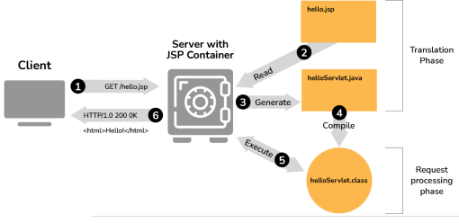
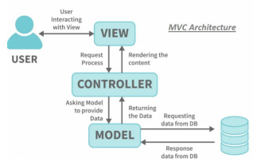
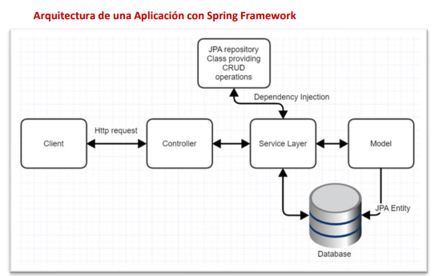

# 🚀 **Desarrollo Backend con JSP y Spring**

## 🖥️ 1. Servidor Web: Apache Tomcat

**Apache Tomcat** es un **contenedor de servlets y JSP** desarrollado por la Apache Software Foundation bajo el proyecto Jakarta.

🔹 Características clave:

* Implementa **Servlet** y **JavaServer Pages (JSP)**.
* Usa el contenedor **Catalina**.
* Versiones modernas: **Tomcat 9.x y 10.x**.
* Software libre bajo licencia Apache.

📁 **Estructura de directorios**:

* `bin` → scripts de inicio y parada
* `conf` → archivos de configuración
* `webapps` → aplicaciones web
* `logs` → registros del servidor
* `temp` / `work` → archivos temporales

⚙️ **Archivo `server.xml`**
Es el núcleo de configuración del servidor:

* `<Server>` → servidor principal
* `<Service>` → agrupa conectores
* `<Connector>` → puertos y protocolos
* `<Engine>` → procesamiento de solicitudes
* `<Host>` → host virtual
* `<Context>` → aplicación web


## 📦 2. Gestión de Dependencias con Maven

**Maven** es una herramienta que automatiza la construcción de proyectos Java.

🔧 Permite:

* Gestionar dependencias
* Compilar código
* Ejecutar pruebas
* Empaquetar (`.jar`, `.war`)
* Desplegar aplicaciones

📄 **Archivo clave: `pom.xml`**
Contiene:

* Información del proyecto
* Dependencias
* Configuración del compilador

🔄 **Ciclo de vida Maven**:

* `compile`
* `test`
* `package`
* `install`
* `deploy`

🧩 Se integra con IDEs como **IntelliJ IDEA, Eclipse y NetBeans**.


## 📄 3. Jakarta Server Pages (JSP)

**JSP** es un lenguaje del lado servidor que permite generar contenido web dinámico usando Java.

✨ Ventajas:

* Independiente de plataforma
* Acceso completo a APIs Java
* Integración directa con bases de datos (JDBC)

🔁 **Procesamiento JSP**:

1. El servidor recibe la solicitud
2. Convierte JSP en servlet
3. Compila y ejecuta
4. Genera HTML para el navegador




## ✍️ 4. Sintaxis Básica de JSP

### 🔹 Scriptlets

Permiten escribir código Java:

```jsp
<% out.println("Hola desde JSP"); %>
```

### 🔹 Declaraciones

Definen variables o métodos:

```jsp
<%! int contador = 0; %>
```

### 🔹 Expresiones

Muestran resultados en HTML:

```jsp
<%= new java.util.Date() %>
```

### 💬 Comentarios JSP

```jsp
<%-- Comentario JSP --%>
```


## 🧭 5. Directivas y Acciones JSP

### 📌 Directivas

Controlan el comportamiento de la página:

* `<%@ page %>` → configuración general
* `<%@ include %>` → incluir archivos
* `<%@ taglib %>` → librerías de etiquetas

### ⚙️ Acciones JSP

Controlan el flujo de ejecución:

```jsp
<jsp:action_name />
```


## 🧰 6. Objetos Implícitos JSP

JSP proporciona **9 objetos automáticos**, entre ellos:

* `request` → datos del cliente
* `response` → respuesta HTTP
* `session` → datos de sesión
* `application` → contexto global
* `out` → salida al navegador

📌 Facilitan la interacción entre cliente y servidor.


## 🏗️ 7. Arquitectura MVC en JSP

El patrón **MVC (Modelo–Vista–Controlador)** separa responsabilidades:

* **Vista:** JSP
* **Controlador:** Servlets
* **Modelo:** Clases Java / Base de datos

  

🎯 Beneficios:

* Mejor organización
* Código mantenible
* Separación de lógica y presentación


## 🌱 8. Spring Framework

**Spring** es un framework robusto para aplicaciones empresariales Java.

### 🔄 Inversión de Control (IoC)

El framework gestiona la creación y ciclo de vida de los objetos.

### 💉 Inyección de Dependencias (DI)

Las dependencias se inyectan automáticamente:

* Por constructor
* Por setters
* Por configuración XML o anotaciones

### 🫘 Beans

Son componentes Java administrados por Spring.

📦 **Spring Container**

* Crea
* Configura
* Relaciona
* Destruye objetos automáticamente


## ⚡ 9. Spring Boot

**Spring Boot** simplifica el desarrollo con Spring.

🚀 Características:

* Configuración automática
* Servidor embebido
* Menos código repetitivo
* Ideal para APIs REST

  

🌐 Inicialización rápida:
👉 [https://start.spring.io](https://start.spring.io)

