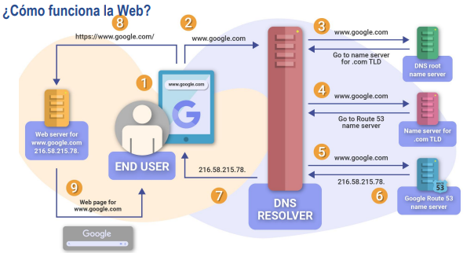

El inicio de una aventura digital.

## Introducción al curso de Desarrollo web

## Contenido

En la primera semana de clase se hizo la introducción sobre los fundamentos de la tencología web. presentando los siguientes temas:

🔹 Estrategia de aprendizaje

🔹 Tecnologías de desarrollo de software

🔹 Estándares Internacionales para el Desarrollo Web

🔹 ¿Cómo funciona la web? / DNS

🔹 Contexto de Aplicaciones de Internet

🔹 FrontEnd

🔹 BackEnd

En este blog se hablará sobre todo el contenido que me llamó la atención 

### ¿Cómo funciona la web?

## FrontEnd y BackEnd

Es importante que en el desarrollo de aplicaciones web se tenga estos dos desarrollos. El desarrollo frontend se encarga basicamente de la interfaz y la experencia que va tener el usuario al utilizar la aplicación. En este apartado se ve HTML, CSS y Javascript.

En cambio, el Backend se encarga de la aprte logica, la base de datos y el funcionamiento interno de la aplicación. En este desarrollo se trabaja con.

🔹 Lenguajes de programación como Python, Java, PHP, Node.js, Ruby

🔹 Bases de datos como MySQL, PostgreSQL, MongoDB

🔹 Servidores y APIs que permiten la comunicación entre el frontend y el backend

## DNS - Sistema de Nombres de Dominio 

El DNS es la dirección telefónico del Internet. Para acceder a la información se usa nombres de dominio. EN el caso de los navegadores web usan direccion IP. Al final el DNS traduce el nombre del dominio a la direccion IP para acceder en los navegadores.

